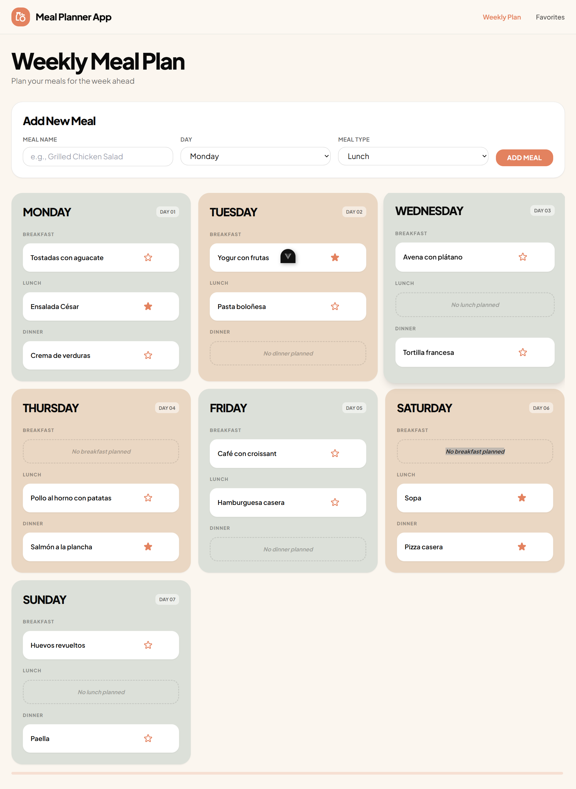
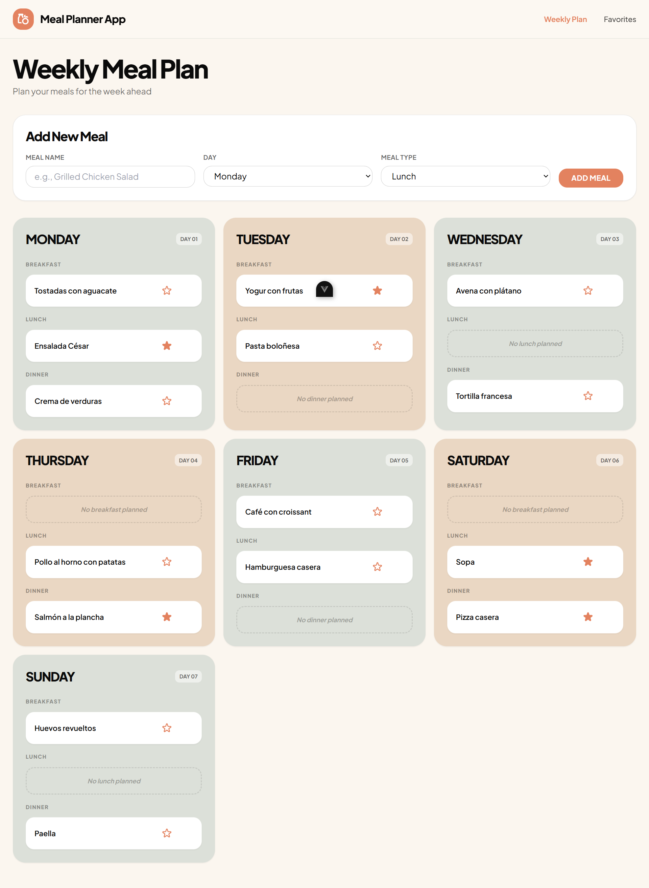

# 🍽️ Meal Planner App

Aplicación web de planificación semanal de comidas desarrollada con Vue 3, TypeScript, Pinia y Tailwind CSS.

## 📸 Capturas

### Vista principal - Plan semanal

### Vista de favoritos

## ✅ Funcionalidades implementadas

- **Formulario de comidas**: Añade platos indicando nombre, día de la semana y tipo de comida (desayuno, comida, cena)
- **Plan semanal**: Visualización de las 7 días de la semana con sus comidas organizadas por tipo
- **Gestión de favoritos**: Marca/desmarca platos favoritos con visualización dedicada
- **Eliminación de platos**: Cada plato tiene su botón de eliminar
- **Persistencia de datos**: El plan semanal se mantiene al recargar la página (pinia-plugin-persistedstate)
- **Navegación**: Vue Router con dos vistas principales (Plan semanal y Favoritos)
- **Diseño responsive**: Adaptado a móviles y escritorio con Tailwind CSS